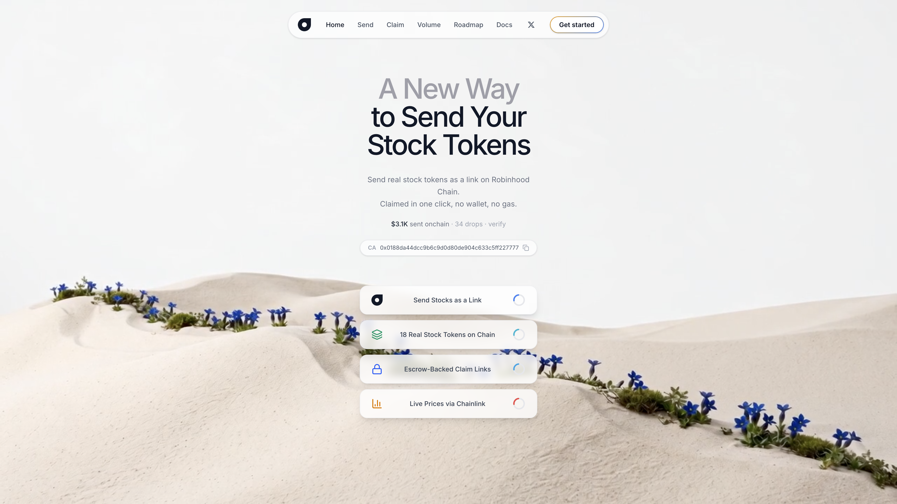
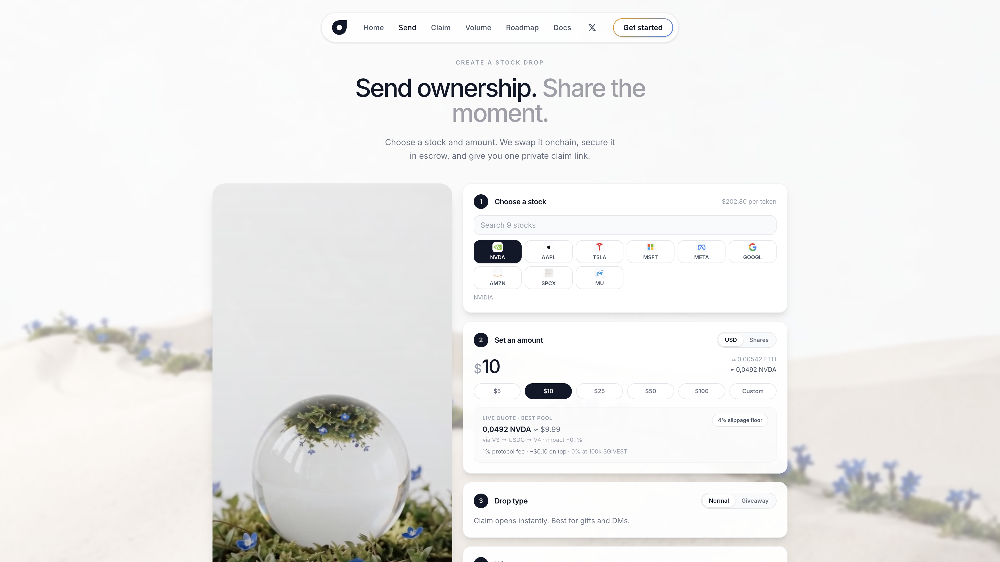
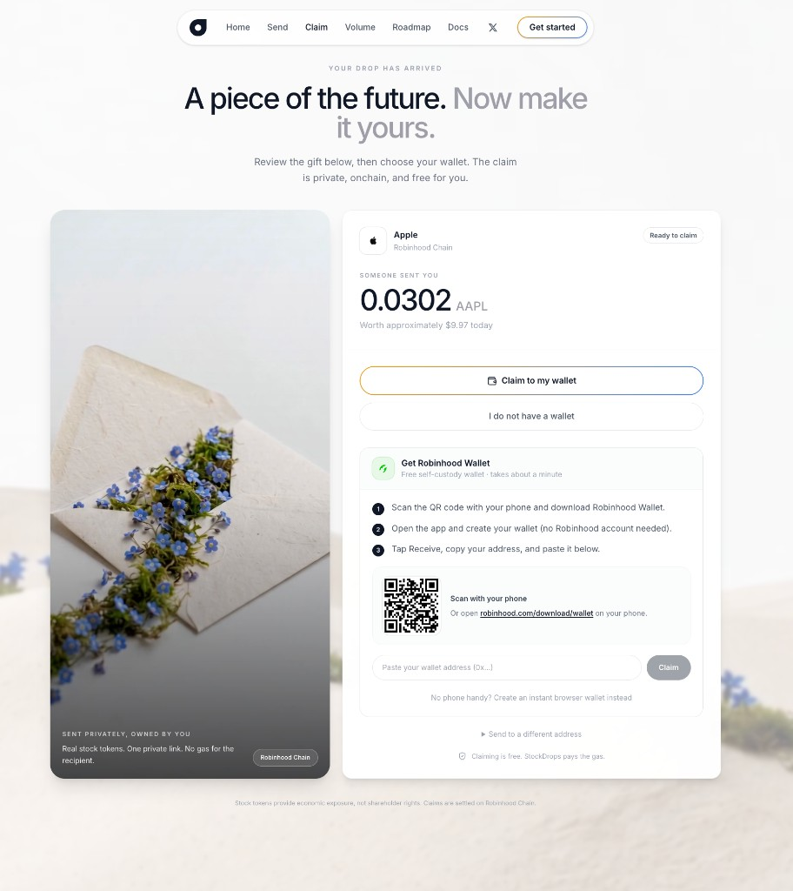

<div align="center">


# Givest

**Send real tokenized stocks as a link - on Robinhood Chain.**

[](LICENSE)
[](https://robinhoodchain.blockscout.com)
[](#quickstart)

[**usegivest.app**](https://usegivest.app) · [Verify volume onchain](https://usegivest.app/volume) · [@usegivest](https://x.com/usegivest)

<br />



</div>

<br />

Pick a stock and an amount. Givest swaps ETH into the stock token onchain, locks it in an escrow contract, and gives you one private claim link. The receiver claims in one click - no wallet setup, no gas. Unclaimed drops can always be refunded by the sender.

## How it works

1. **Create**: `createDropWithEth` wraps your ETH, swaps it into the stock token via Uniswap (v3 or v4, best route wins), and locks the output in escrow, all in one transaction. Each drop is bound to a one-time *claim key* whose private key exists only inside the link.
2. **Claim**: the receiver signs their wallet address with the claim key from the link. Anyone (in practice our relayer) can submit the transaction; the contract verifies the signature and pays out. The receiver never pays gas.
3. **Refund**: the sender can withdraw an unclaimed drop at any time. After expiry (30 days) anyone can push the tokens back to the sender.

<br />

<div align="center">

| Send | Claim |
| :---: | :---: |
|  |  |
| Live Uniswap quotes before you send | Robinhood Wallet onboarding built in |

</div>

<br />

Built on the same primitive:

- **Giveaway mode**: claiming unlocks at a random time inside a window the sender picks, so public giveaways can't be sniped the second they are posted.
- **Split drops**: one link, N equal shares, one claim per wallet.
- **Verified senders**: connect your X account and the receiver sees who the drop is from, attested server-side (HMAC over the claim key + handle).
- **No-wallet onboarding**: receivers without a wallet are guided into Robinhood Wallet directly inside the claim flow, device-aware (App Store, Google Play, or QR on desktop).

## The contract

`StockDrops.sol` is a single self-contained escrow contract, no proxies and no upgradability. Deployed instances are listed on [usegivest.app/volume](https://usegivest.app/volume).

**Creating a drop.** Four entry points cover every route:

| Function | Route |
| --- | --- |
| `createDrop` | deposit stock tokens you already hold |
| `createDropWithEth` | ETH, swapped via a Uniswap V3 path |
| `createDropWithEthV4` | ETH, swapped in a single Uniswap V4 pool |
| `createDropWithEthViaUsdgV4` | ETH to USDG on V3, then USDG to the stock on V4 |

Every create takes a `claimKey` (the address of a one-time keypair whose private key lives only in the claim link), an expiry, a `claimableAt` timestamp (giveaway unlock) and a `splits` count (number of winners). The swap and the escrow registration happen atomically in one transaction, with a `minOut` slippage floor.

**Claiming.** `claim(claimKey, recipient, signature)` verifies that the claim key signed the recipient address (`claimDigest` is an EIP-191 digest of contract address, chain id, claim key and recipient). Anyone can submit the transaction, which is what makes claims gasless for the receiver: our relayer submits, the contract pays out. One claim per wallet, `splits` claims in total, each for an equal share.

**Refunding.** `refund` lets the sender pull back an unclaimed drop at any time. After expiry, `refundExpired` lets anyone push the remaining tokens back to the sender.

**Fees.** A basis-point fee is taken on create (`ProtocolFeePaid`), with discounts based on the sender's $GIVEST balance: 1% base, reduced at 10k, zero at 100k. Fee config is capped and only adjustable by the owner (`setFeeConfig`), and fees fund the relayer's gas and public giveaways.

**Events.** `DropCreated`, `DropClaimed`, `DropRefunded` and `ProtocolFeePaid` make every drop fully auditable. The volume page reads these events straight from Blockscout.

Tests in `contracts/test/StockDrops.t.sol` run against a fork of Robinhood Chain mainnet and cover claims, double-claim protection, bad signatures, expiry, giveaway locks, splits and refunds.

## Repository layout

```
contracts/   Foundry project - StockDrops.sol escrow + fork tests
web/         Next.js app - send flow, claim page, relayer + stats API
docs/        Screenshots and assets for this README
```

## Quickstart

### Contracts

```bash
cd contracts
forge install foundry-rs/forge-std
forge test --fork-url https://rpc.mainnet.chain.robinhood.com
```

### Web app

```bash
cd web
cp .env.example .env.local   # fill in contract address + relayer key
npm install
npm run dev
```

### Local end-to-end demo

```bash
# 1. Fork mainnet
anvil --fork-url https://rpc.mainnet.chain.robinhood.com

# 2. Deploy against the fork
cd contracts
forge create src/StockDrops.sol:StockDrops --rpc-url http://127.0.0.1:8545 \
  --private-key <anvil-key> --broadcast \
  --constructor-args <WETH> <V3_ROUTER> <V4_POOL_MANAGER> <FEE_RECIPIENT>

# 3. Point web/.env.local at the fork + contract, then npm run dev
```

## Addresses (Robinhood Chain mainnet, chain id 4663)

| What | Address |
| --- | --- |
| WETH | `0x0Bd7D308f8E1639FAb988df18A8011f41EAcAD73` |
| USDG | `0x5fc5360D0400a0Fd4f2af552ADD042D716F1d168` |
| Uniswap V3 SwapRouter | `0xCaf681a66D020601342297493863E78C959E5cb2` |
| Stock tokens + Chainlink feeds | see `web/lib/config.ts` |

Escrow contracts and all protocol volume are public - every create and claim can be verified on [Blockscout](https://robinhoodchain.blockscout.com).

## Security model

- The claim link **is** the money: whoever has the link can claim the drop. Links are never stored server-side.
- The relayer key only pays gas and never holds user funds; drops sit in the escrow contract until claimed or refunded.
- Protocol fees (1% on create, discounted for $GIVEST holders, 0% at 100k) fund gasless claims and public giveaways.

Found a vulnerability? Please reach out privately on X [@usegivest](https://x.com/usegivest) before disclosing.

## Disclaimer

Stock tokens on Robinhood Chain provide economic exposure to the underlying stock - not shareholder rights. See Robinhood Chain's documentation.

## License

[MIT](LICENSE)
